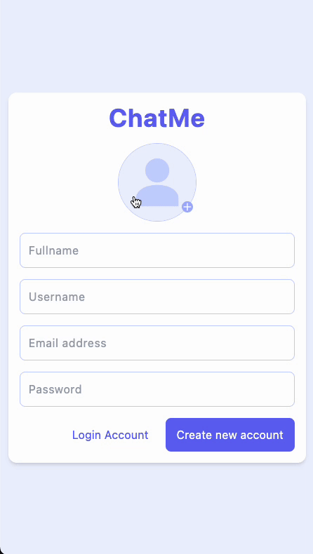
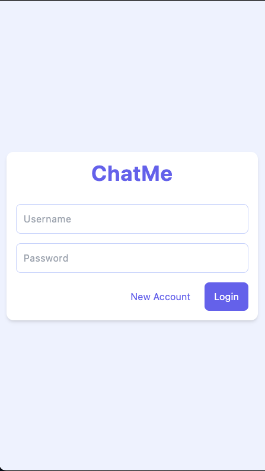
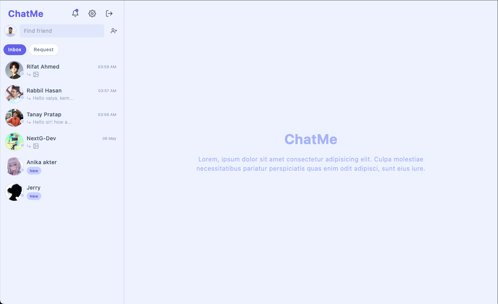
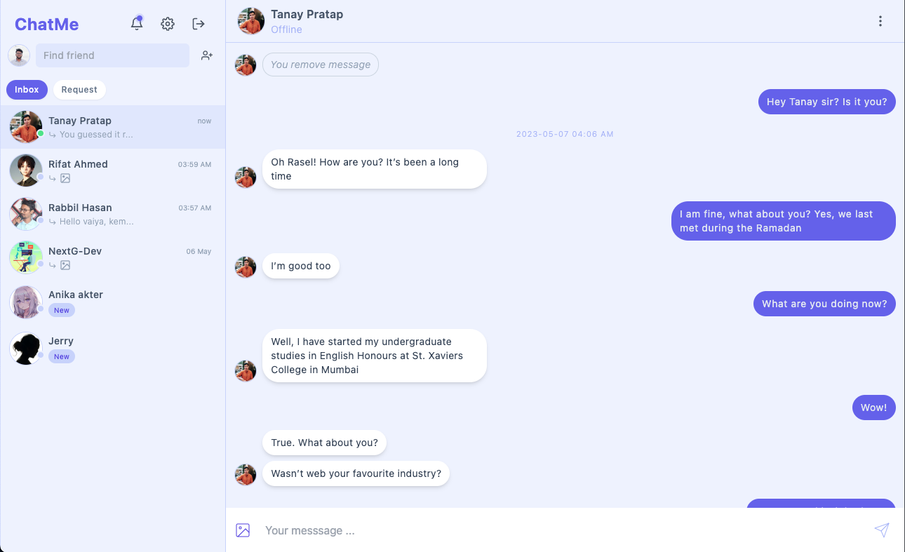
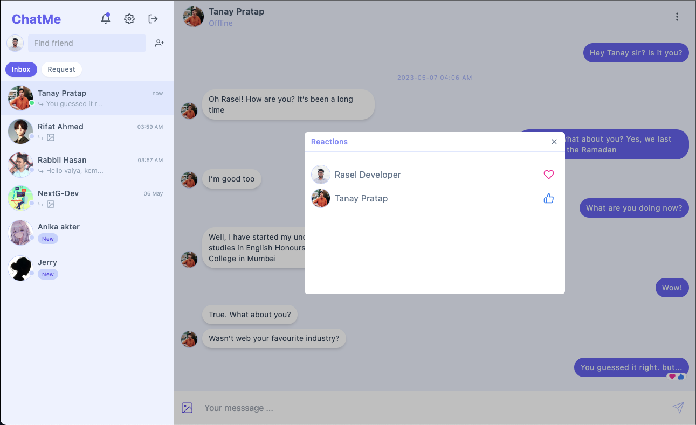
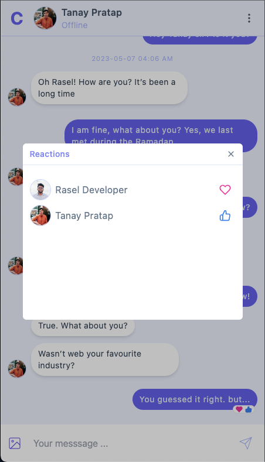
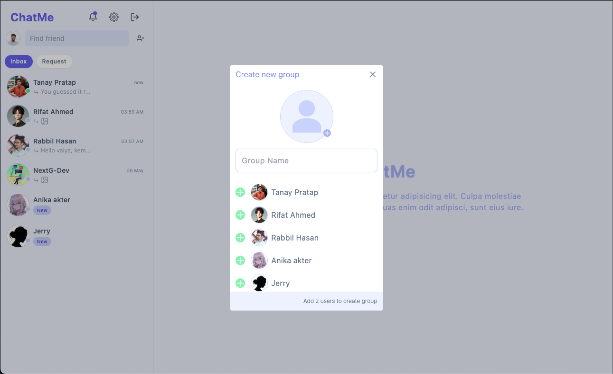
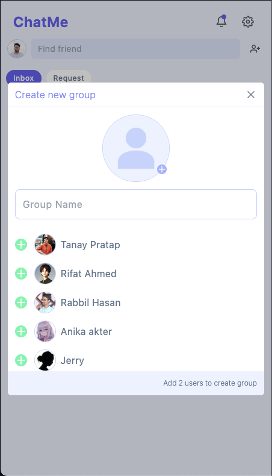
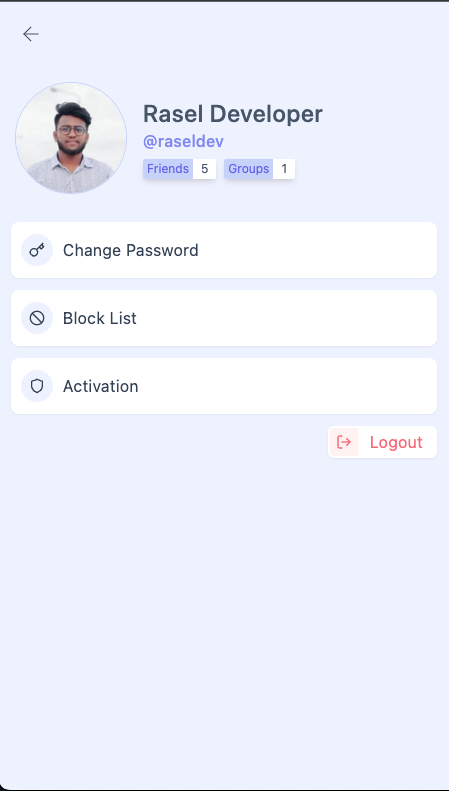

# ChatMe UI

Simple and minimalistic Chatting application like: Messanger, WhatsApp etc.

# Screenshots

## Register

|              Desktop              |              Mobile              |
| :-------------------------------: | :------------------------------: |
|  |  |

## Login

|            Desktop             |            Mobile             |
| :----------------------------: | :---------------------------: |
|  |  |

## Friend List

|               Desktop               |               Mobile               |
| :---------------------------------: | :--------------------------------: |
|  |  |

## Chat List

|              Desktop              |              Mobile              |
| :-------------------------------: | :------------------------------: |
|  |  |

## Message Reaction

|              Desktop              |              Mobile              |
| :-------------------------------: | :------------------------------: |
|  |  |

## Create Group

|               Desktop                |               Mobile                |
| :----------------------------------: | :---------------------------------: |
|  |  |

## Others

|             Notification             |            Settings             |
| :----------------------------------: | :-----------------------------: |
|  |  |
